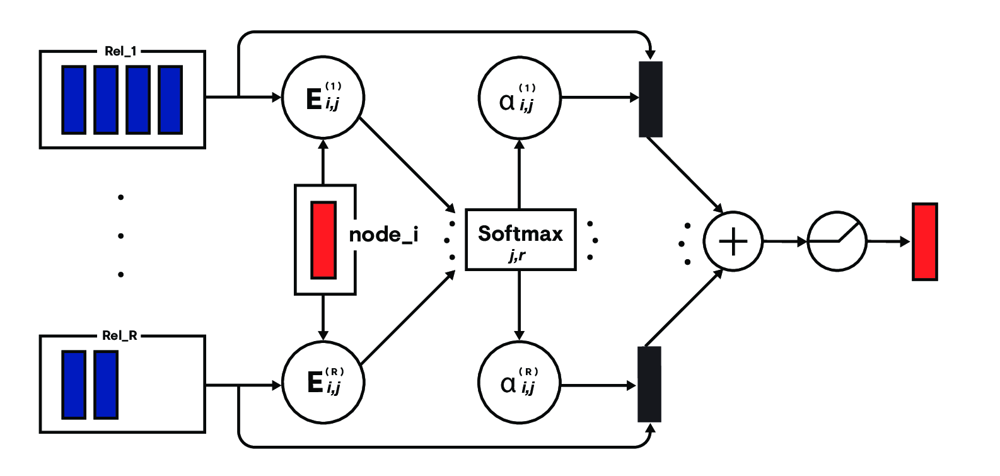

# Relational Graph Attention Networks

A TensorFlow implementation of Relational Graph Attention Networks for semi-supervised node classification and graph classification tasks introduced in our paper [Relational Graph Attention Networks](https://openreview.net/forum?id=Bklzkh0qFm). It is compatible with static and eager execution modes.

Contact [dan.busbridge@babylonhealth.com](mailto:dan.busbridge@babylonhealth.com) for comments and questions.



## Installation
To install `rgat`, run:
```
$ pip install git+git://github.com/Babylonpartners/rgat.git
```
To allow both the CPU and GPU versions of TensorFlow, we have not listed Tensorflow as a requirement. You will need to install a version separately. The TensorFlow version must be >= 1.10.

## Examples
To make it easy to jump right in, we have provided a few examples:
+ [RDF](examples/rdf): Semi-supervised node classification on AIFB and MUTAG.
+ [Batch comparison](examples/batching): Batched graph forward pass examples using both static and eager mode.

## Usage
The graphs handles are composed of:
+ An `inputs` dense tensor* corresponding to node features, and
+ A `support` sparse tensor corresponding to node connectivity.

Below is a standard pattern for using RGAT
```python
from rgat.layers import RGAT

inputs = get_inputs()                                # Dense tensor with shape (?, Features)

support = get_support()                              # Sparse tensor with dense shape (?, ?)
support = tf.sparse_reorder(support)                 # May be neccessary, depending on construction

rgat = RGAT(units=FLAGS.units, relations=RELATIONS)  # RELATIONS is an integer indicating the number 
                                                     # of relation types in the graph

outputs = rgat(inputs=inputs, support=support)       # Dense tensor with shape (?, FLAGS.units)
```
Here, `get_inputs` and `get_support` are user-provided functions. 
For guidance on their definition, see the [usage guide](docs/usage_guide.md).

*Note, it *is* possible to pass a `SparseTensor` as the inputs to the layer call. 
This will result in the identity matrix for the input (but skipping the trivial matrix multiply).

## Cite

Please cite our paper if you use this code in your own work:
```
@article{busbridge2019rgat,
title = {Relational Graph Attention Networks},
author = {Busbridge, Dan and Sherburn, Dane and Cavallo, Pietro and Hammerla, Nils Y},
year = {2019},
eprint = {arXiv:1904.05811},
url = {http://arxiv.org/abs/1904.05811}
}
```
